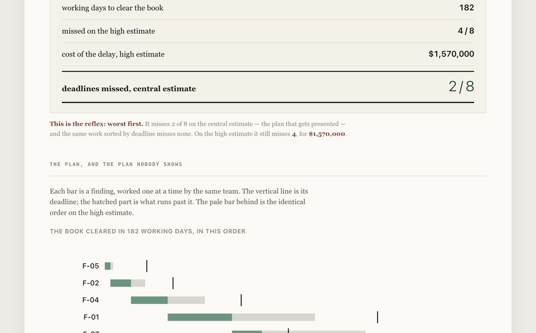

# The order is the plan

Eight remediation findings, one team, a deadline on each line. The plan that gets presented
is built on the central estimate. This one is built twice.

**The finding.** Taking the worst finding first — the reflex in every room — misses **3 of
8 deadlines** on the central estimate and costs **$695,000**. The identical work sorted by
deadline misses **none**. On the high estimate, which nobody plans on, the reflex misses 5
and costs **$1,825,000** against **$450,000**. Same findings, same team, same total effort:
only the order changes.

**[Try it in your browser →](https://arslanesempai-ui.github.io/remediation-backlog/)** —
take a row to move that finding to the front and watch which deadlines fall. Nothing is
uploaded.



```bash
npm start   # the screen, on localhost:4680
npm test    # types and <!--p:portfolio.parDepot.remediation-->61<!--/p--> tests
```

Node with native TypeScript, no build step, no runtime dependencies.

---

## What a status spreadsheet cannot show

A remediation tracker has a line per finding, a RAG pastille, and an owner. It contains
everything except the two facts that decide the outcome.

**The first is that the team is one team.** Three people on eight workstreams do not run
eight workstreams; they run one at a time, more slowly. The moment that is true, the order
is a decision — and it is the only decision anyone in the room actually controls.

**The second is that an estimate is a range.** Everyone knows it while giving it and nobody
plans on it. So the plan clears every deadline, and then it does not.

<!-- figures:ordres -->
| Order | Missed, central | Cost, central | Missed, high | Cost, high |
|---|---|---|---|---|
| Worst first | 3 | $695,000 | 5 | $1,825,000 |
| Earliest deadline first | 0 | $0 | 2 | $450,000 |
| Shortest first | 0 | $0 | 3 | $1,580,000 |
| Least slack first | 0 | $0 | 6 | $645,000 |
<!-- /figures:ordres -->

<!-- figures:lecture -->
Read the last two rows together. **Least slack first misses 6 deadlines against 3, and costs $645,000 against $1,580,000 — 40.8 % of the money.** Counting red lines and counting money do not rank the same, and a tracker that counts red lines will recommend the expensive one.
<!-- /figures:lecture -->

## What is measured here, and what is not

Nothing. Every number in this repository is assumed or chosen: the findings are a plausible
inspection, the estimates are what an estimate looks like, and the cost of a month late is
an order of magnitude, not a quote.

That is deliberate and it is the point. The claim is not "your remediation will cost
$695,000". The claim is **the order changes the answer at identical work**, and that holds
whatever numbers you put in — which is why the team size and the ordering are yours to move
on the screen.

<!-- figures:provenance -->
**3 assumed**, **1 chosen**. What each kind means, and what you are entitled to ask of it:

- **assumed** — an input nobody here can know; yours to supply. *put your own figure in, and read the band around it.*
- **chosen** — my judgement and nothing else. *check whether the sweep says it decides anything.*

| Kind | Name | What it is | Note |
|---|---|---|---|
| assumed | `charge` | person-days per finding, low / central / high | an estimate given as three numbers, because that is what an estimate is |
| assumed | `echeance` | working days until the finding must be closed | the ones committed to the regulator are marked; the others are internal |
| assumed | `equipe` | people on remediation and usable days a month | sixteen usable days out of about twenty-one working ones |
| chosen | `coutParMoisDeRetard` | cost of one month late, per finding | fines, remediation and enhanced supervision, as an order of magnitude |
<!-- /figures:provenance -->

## The test that changed the finding

The first version of this README said "the order that wins on the central estimate is not
the one that wins on the high estimate". I wrote a test to hold that sentence and it failed
immediately: sorting by deadline wins on both. The sentence was mine, not the model's.

What the tests hold now is what is true, and it is enough: the reflex costs more on both
estimates, one team means one finding at a time, a month late is a month billed, and an
order can miss more deadlines while costing less.
